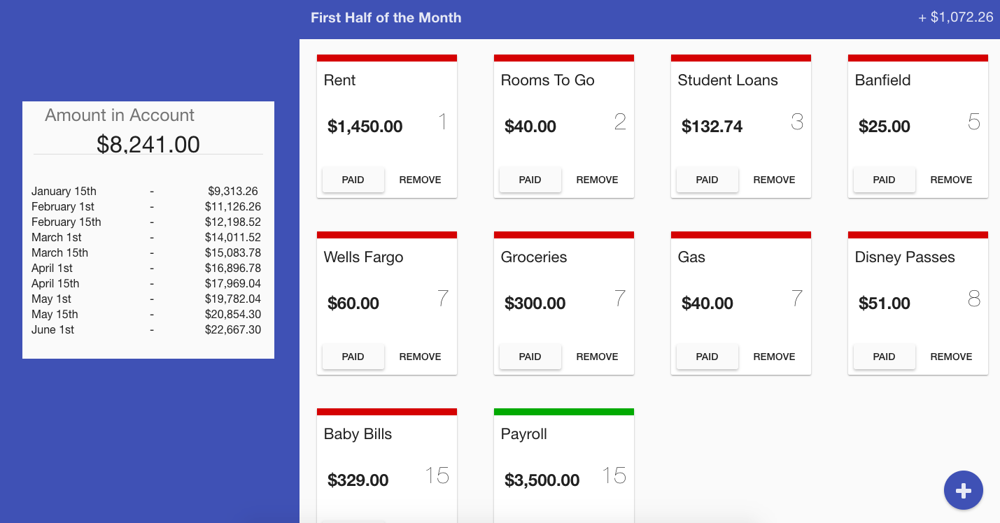

# ballpark
Brushing up on my Angular - Ballpark: The More or Less Expense Tracker

###Demo Image

###Features
Add Expenses and Income and ballpark will give you projections on where you will be financially at the beginning and middle of each month. You can add how much is in your current checking account to give you a better idea of where you will be financially if you stick to your budget. If you have already paid an expense and your current checking account reflects that, you can mark the item as paid to give you a more accurate account.

###Why?
I've been using an excel spreadsheet to budget for as long as I can remember. I felt it was about time I created something I can use!

###Technologies
* AngularJS v1.6
* NodeJS
* Express
* MongoDB/Mongoose
* Angular Material
